# NetPaw 🐾

**Static-IP profiles for Windows network admins — in the tray, one hotkey away.**

You plug into a switch that lives on `192.168.88.0/24`, then a customer LAN on `10.20.0.0/16`,
then you need DHCP again, then the Fortigate at `192.168.1.99`… NetPaw makes each of those one
keystroke instead of a trip through *Control Panel → Network → Adapter → Properties → IPv4*.

- **Profiles** — IP(s), prefix, gateway, DNS, suffix, metric, routes, VLAN id, per adapter.
- **Multiple subnets at once** — the first address is the primary, every further line is added as a
  secondary, so one profile can sit in several subnets on the same VLAN.
- **DHCP in one click** (or `Ctrl+D` in the panel).
- **Reach mode** — type an IP. NetPaw picks a profile that covers it, or knows the device's
  factory subnet from the preset list, or adds a temporary address next to it. Nothing to configure.
- **Device presets** — factory default addresses of ~60 common routers, switches, firewalls,
  cameras (MikroTik, Ubiquiti, Cisco, Fortinet, FRITZ!Box, …). Pick one, you're on its subnet.
- **VLAN aware** — detects whether the NIC driver exposes 802.1Q tagging (`VlanID`) and only then
  offers to set it. No pretending on drivers that can't.
- **Static routes** per profile (`10.0.0.0/8 via 192.168.1.1 metric 10`).
- **Global hotkeys** — one to open the panel, one per profile if you like.
- **Transparent** — every change is a plain `netsh` command you can preview and copy. Nothing hidden
  in WMI calls; the log shows exactly what ran.
- **Tiny and fast** — two executables, ~1.5 MB together, no installer, no service, no telemetry.
- **Network info card** — `Ctrl+Alt+I`: link, address, gateway, DNS, intranet, internet as ✓/✗ with round-trips. Every other host-facing adapter (dock while on Wi-Fi, second NIC, vEthernet) gets an *Also* row with its address and a gateway ping, and its own advice lines — the work adapter stays the target of repairs. Pin it with 📌.
- **Monitor mode** (opt-in) — probes gateway/intranet/internet/DNS on an interval and tells you *what* changed: "Internet lost — intranet still reachable", "Link down", "Back online". A red dot on the paw while there is a problem; the card pins itself until things recover.
- **Advisory** — the card says *what* is wrong: "lease without gateway (option 3)", "no DHCP lease (169.254)", "gateway from lease does not answer — stale after a port move?", "DNS servers not answering". Static profiles get the matching hints.
- **Auto-repair** (opt-in) — when the advisory says a fresh lease could help, NetPaw runs `ipconfig /renew` itself: bounded attempts per incident, spaced, DHCP adapters only, every attempt logged.
- **Incident log** (opt-in) — timestamps of every state change and configuration finding in `incidents.jsonl`, for "when did the WAN drop?" and tickets.
- **Scan for a working profile** — tries DHCP then your profiles on the port, measures each, stops at the first fully working one or ranks them all; restores your config unless you keep a winner.
- **Network map** — ARP neighbours bundled per subnet (passive), active re-check or subnet sweep, and *find routers*: borrow an address in each common/vendor subnet, ARP the usual gateways, report who answers with vendor hints.
- **Auto-switch** (opt-in per profile) — learn a network's fingerprint (gateway MAC, subnet, DHCP server, DNS suffix, ARP neighbours, plus the LLDP/CDP switch port and Wi-Fi BSSID when known — weighted, so a shared VRRP MAC or a common subnet alone never triggers); on link-up NetPaw applies the profile that scores best by a clear margin. Asks once, undo in the menu, never on ambiguity.
- **Update check** (opt-in — asked once on first start; one GitHub API call a day, never downloads) — a balloon once per newer release; click opens the release page. *Settings → Updates* or policy `AllowUpdateCheck=0` turns it off.
- **Verify after apply** — every change (profile, DHCP, undo, repair, CLI) re-reads the adapter 2 s later, including static routes and the interface metric; the Windows "static applied but still shows DHCP / two gateways" state and a route Windows refused are caught, and *Reset adapter* clears it. The CLI returns 1 with the diff. Dock problems ("old NIC still holds the lease") and "two default gateways" get one-click fixes (Release / Prefer).
- **VPN status** — WireGuard, OpenVPN, Windows native, Tailscale, ZeroTier: up/down, full vs split tunnel, change notifications.
- **Which switch port am I on?** — LLDP/CDP via Windows' built-in `pktmon` (no driver, nothing sent): switch name, port, VLAN, management address. Optional after every link-up.
- **Captive-portal detection** with checks on.
- **Telemetry build extras** — OTLP/HTTP logs and RFC 5424 syslog to your own collector (incidents / actions).
- **F1 help** on every view.
- **CLI twin** (`netpaw-cli.exe`) for scripts and remote sessions. Same profiles, same logic.
- **Enterprise-ready** — MSI for Intune/GPO, read-only managed profiles from `%ProgramData%`, registry policy with ADMX (pin the adapter/hotkey, deny reach/DHCP/user profiles). See [docs/ENTERPRISE.md](docs/ENTERPRISE.md).
- **Online profile packs** — subscribe to signed `index.json` repositories (the community pack in this repo, or your company's). Fetched only when you click *Sync*, cached, never auto-applied. See [docs/PACK-FORMAT.md](docs/PACK-FORMAT.md).

MIT licensed. Windows 10/11, .NET 10.

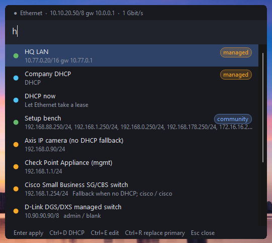

| profile editor (managed profile, read-only) | settings with repositories | apply feedback |
|---|---|---|
| 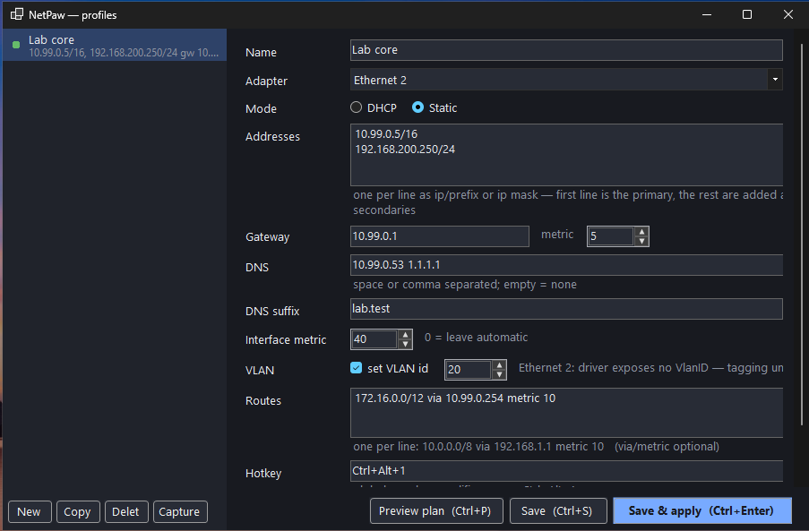 | 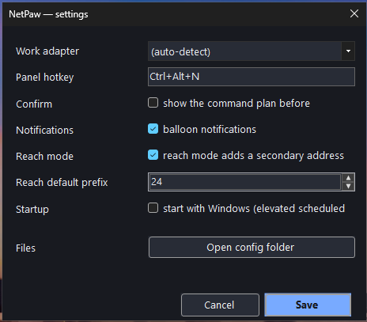 | 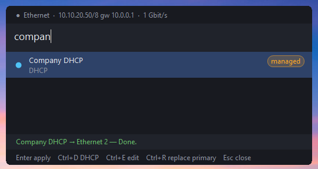 |

| network info card | sticky alert (cable pulled) | advice row | F1 help |
|---|---|---|---|
| 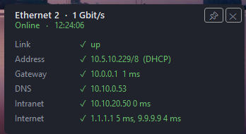 | 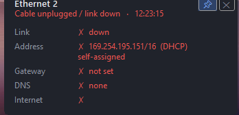 | 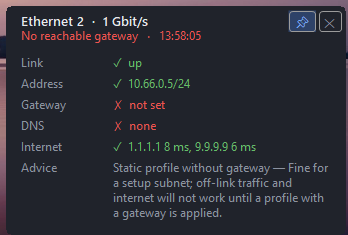 | 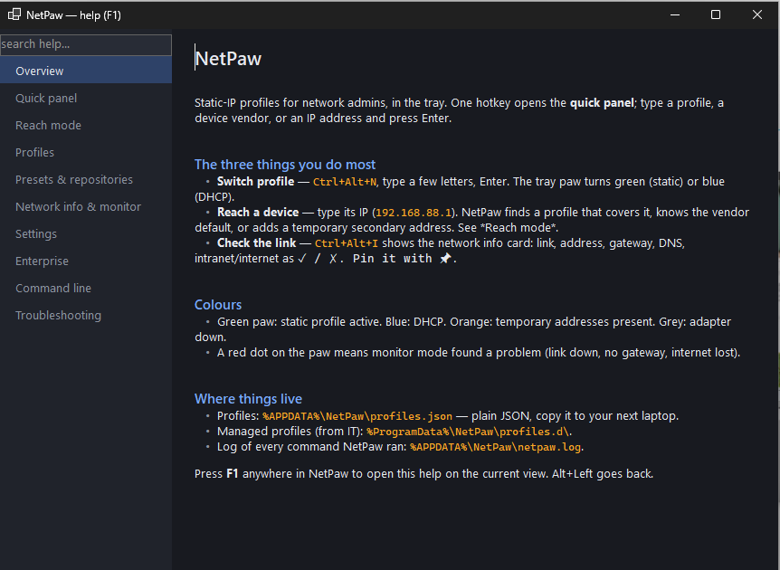 |

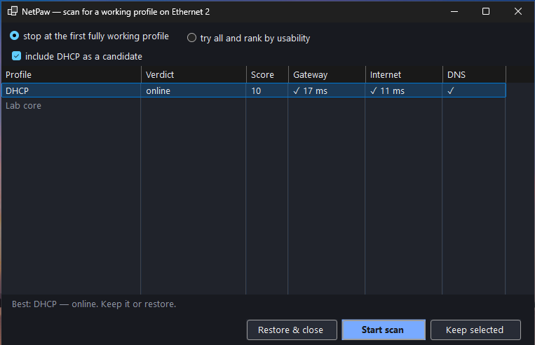

| network map — ARP neighbours | which switch port am I on? (LLDP via pktmon) |
|---|---|
| 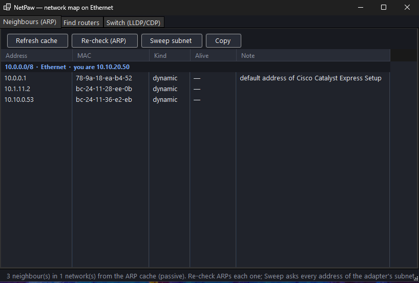 | 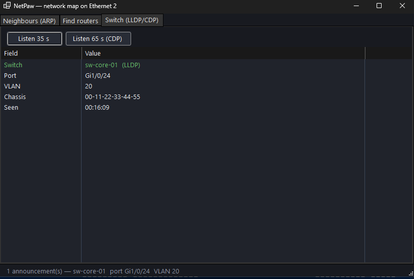 |

*Screenshots from the Windows 11 test VM; every `netsh` path in this README was verified there.*

## Install

Grab a zip from [Releases](../../releases):

| zip | needs | size |
|---|---|---|
| `netpaw-win-x64.zip` | [.NET 10 Desktop Runtime](https://dotnet.microsoft.com/download/dotnet/10.0) | ~1.5 MB |
| `netpaw-win-x64-standalone.zip` | nothing | ~110 MB |
| `NetPaw-<version>.msi` | [.NET 10 Desktop Runtime](https://dotnet.microsoft.com/download/dotnet/10.0) | ~1 MB, per-machine, for Intune/GPO |
| `NetPaw-<version>-telemetry.msi` | same | same, **plus crash reports and anonymous usage counts** — opt-in by choosing this download; see [docs/TELEMETRY.md](docs/TELEMETRY.md) |

Everything except the `-telemetry` MSI contains no telemetry code at all.

Unzip anywhere, run `NetPaw.exe`. It asks for elevation once (adapter changes need it) and lives in the
tray. *Settings → start with Windows* creates an elevated scheduled task so there is no UAC prompt at
logon.

## Use

| do | how |
|---|---|
| open the panel | `Ctrl+Alt+N` (configurable), left-click the tray paw, or run `NetPaw.exe` again |
| apply a profile | type a few letters, `Enter` — or its hotkey, or the tray menu |
| DHCP | `Ctrl+D` in the panel, or *DHCP now* in the menu |
| reach a device | type its IP in the panel, `Enter`. `Ctrl+R` replaces the primary instead of adding a secondary |
| use a preset | type the vendor (`mikro`, `forti`, `fritz`…) or pick *Device presets* in the menu |
| save what's configured right now | *Capture current as profile…* |
| undo temporary addresses | *Remove N temporary addresses* (menu / panel) |
| see what will run | *Settings → confirm before applying*, or *Preview plan* in the editor |
| weak Wi-Fi / 802.1X refused / path MTU 1452? | info card rows *Wi-Fi*, *802.1X*, *Path MTU* with advice + one-click *Set MTU* |
| which DNS server is dead? | info card DNS row shows each server ✓/✗ (checks on); the advice row names it |
| where does the path stop? | info card → *Trace route to …* when internet/gateway is ✗, or `netpaw-cli trace 1.1.1.1` |
| is that port open from here? | type `10.0.0.5:443` (or `nas:22`) in the panel, or `netpaw-cli check 10.0.0.5:443` |
| see what a change will run | hold **Shift** while picking it (or *Settings → Confirm* for every time), or `netpaw-cli apply <p> -n` |
| check the link | `Ctrl+Alt+I` — the info card; 📌 keeps it |
| get told when the network changes | *Settings → Connectivity → check reachability* + *monitor mode* |
| renew the lease | *Renew DHCP lease* (menu / panel / info card), or `netpaw-cli renew` |
| see what's wrong with the config | info card *Advice* rows, or `netpaw-cli advise` |
| find a profile that works on this port | *Scan for a working profile…* (menu / `scan` in the panel), or `netpaw-cli scan [--all] [--keep]` |
| when did it break? | *Settings → Incident log*, then *Open incident log* or `netpaw-cli incidents` |
| who is on this cable? | *Network map…* (menu / `map` in the panel) → Neighbours, Re-check, Sweep, Find routers; `netpaw-cli arp`, `find-routers` |
| switch automatically on a known network | editor → Advanced → *Learn from current network* + *auto-switch* |
| Windows didn't take the change | info card → *Reset adapter*; `netpaw-cli verify <profile>`, `reset`, `release`, `prefer` |
| help | `F1` anywhere; opens on the current view |

The tray paw is **blue** on DHCP, **green** on static, **orange** while temporary addresses are
present, **grey** when the adapter is down.

### Reach mode, precisely

Typing `192.168.88.1` does, in order:

1. Adapter already has an address in that subnet → nothing to do.
2. A saved profile covers it (by address or by static route) → apply that profile.
3. It's the default address of a known device → add a host address in *that* subnet (e.g. `/8` for D-Link's `10.90.90.90`).
4. Otherwise assume a `/24` (configurable) and add a temporary host address from the **top** of the
   subnet (`.254`, `.253`, …), skipping the target and anything already in use — so it never collides
   with the `.1`/`.10` most gear ships with.

Steps 3–4 add a **secondary** address by default, so your current primary, gateway and DNS keep working.
If the adapter is on DHCP a secondary is not possible (`netsh` limitation) and NetPaw switches to a
temporary static profile instead; it tells you. `10.20.30.1/28` with an explicit prefix skips the
guessing.

### Monitor mode, precisely

Off by default — nothing is probed until you enable checks. Then every interval NetPaw pings the
default gateway, your extra intranet hosts, the internet targets (`1.1.1.1`, `9.9.9.9`) and resolves
one name. The result is one of: *link down*, *no address* (link up, DHCP silent — a 169.254 address
counts as none), *no reachable gateway*, *intranet only*, *DNS failing*, *online*. Monitor mode
notifies on **transitions only**, after the new state held for 3 s (10 s for *no address*, DHCP
territory) — no nagging. Link up/down is always announced; cable pulls are caught instantly through
Windows' network-change events, not the interval.

### VLAN

Windows only tags if the NIC driver exposes the `VlanID` advanced property (Intel, some Realtek/Marvell,
Hyper-V vNICs). NetPaw reads it through the NetAdapter CIM class — the same data
`Get-NetAdapterAdvancedProperty` shows — and the editor tells you per adapter whether tagging is
available. Setting it resets the link for a few seconds; that is the driver, not NetPaw. Multi-VLAN
trunking on one NIC needs Intel PROSet / Hyper-V switch, which is out of scope.

### CLI

```
netpaw-cli adapters                         list adapters, current config, VLAN capability
netpaw-cli list                             list profiles (* = matches the adapter right now)
netpaw-cli show <profile>                   print one profile
netpaw-cli apply <profile> [-a X] [-n]      apply a profile (-n = dry run, print the plan)
netpaw-cli dhcp [-a X]                      switch the adapter to DHCP
netpaw-cli reach <ip[/prefix]> [--replace]  make <ip> reachable
netpaw-cli check <host:port> [--timeout ms] one TCP connect: open / refused / timeout (rc 0/1/2)
netpaw-cli trace <host> [--max N]           traceroute: where does the path stop?
netpaw-cli preset [query]                   list presets
netpaw-cli preset apply <vendor/model|query>
netpaw-cli capture <name> [-a X]            save the adapter's live config as a profile
netpaw-cli temp | clear-temp                list / remove temporary addresses
netpaw-cli vlan <adapter> [id]              query / set the driver VLAN id (0 = untagged)
netpaw-cli where                            print the config directory
```

```
netpaw-cli export <file> [--managed]    write profiles as JSON (--managed = deployment file for profiles.d)
netpaw-cli import <file>                add profiles from JSON
netpaw-cli policy                       show the effective machine policy
netpaw-cli repo [add|remove|sync|search] online profile repositories
netpaw-cli arp [--check|--sweep] / find-routers [--force] / switch [--seconds N]   network map + LLDP/CDP (--force = allowed to drop a DHCP lease)
netpaw-cli advise / renew / release / reset / prefer / verify <profile>   diagnosis + repairs
netpaw-cli scan [--all] [--repos] [--keep] / incidents [-n N]
netpaw-cli pack keygen|build|sign|verify author and sign a pack
```

Read-only commands work from any prompt; changes need an elevated one. Exit codes: 0 ok, 1 a step failed, 2 usage, 3 not VLAN-capable, 4 denied by policy.

## Files

Everything is JSON in `%APPDATA%\NetPaw\` (override with `NETPAW_HOME`):

- `profiles.json` — your profiles. Hand-editable, git-able, copy to the next laptop.
- `presets.json` — your own device presets; same schema as the bundled list, same Vendor/Model overrides.
- `settings.json`, `state.json` (temporary addresses), `netpaw.log`, `cache\` (synced packs).
- `%ProgramData%\NetPaw\profiles.d\*.json` — managed profiles deployed by your organisation (read-only, *managed* badge).
- `HKLM\SOFTWARE\Policies\NetPaw` — machine policy (see [docs/ENTERPRISE.md](docs/ENTERPRISE.md)).

A profile:

```json
{
  "name": "Lab core",
  "adapter": null,
  "dhcp": false,
  "addresses": [ { "address": "10.20.0.5", "prefixLength": 16 }, { "address": "192.168.88.250", "prefixLength": 24 } ],
  "gateway": "10.20.0.1",
  "dns": [ "10.20.0.53" ],
  "routes": [ { "destination": "172.16.0.0", "prefixLength": 12, "gateway": "10.20.0.254", "metric": 10 } ],
  "vlanId": 20,
  "hotkey": "Ctrl+Alt+1"
}
```

`adapter: null` means "the work adapter" (auto-detected: first physical NIC with a gateway; or pick one
in the tray menu).

## What it runs

A static profile becomes, verbatim:

```
netsh interface ipv4 set address name="Ethernet" source=static address=10.20.0.5 mask=255.255.0.0 gateway=10.20.0.1 gwmetric=1
netsh interface ipv4 add address name="Ethernet" address=192.168.88.250 mask=255.255.255.0
netsh interface ipv4 set dnsservers name="Ethernet" source=static address=10.20.0.53 register=primary validate=no
netsh interface ipv4 add route prefix=172.16.0.0/12 interface="Ethernet" nexthop=10.20.0.254 metric=10 store=persistent
powershell ... Set-NetAdapterAdvancedProperty -Name 'Ethernet' -RegistryKeyword 'VlanID' -RegistryValue 20
```

`set address source=static` replaces every address on the adapter, which is what makes profile
switches deterministic: leftovers from the previous profile or from reach mode are gone in step 1.
The first step is *critical* (a failure aborts the rest); the others are best-effort and reported.

## Build

```
dotnet test                                   # core logic, runs on any OS
dotnet publish src/NetPaw.Tray -c Release -r win-x64 --self-contained false -o out
dotnet publish src/NetPaw.Cli  -c Release -r win-x64 --self-contained false -o out
```

Layout: `src/NetPaw.Core` (models, IP math, planner, reach resolver, presets, policy, repos — no
Windows dependencies, fully unit-tested), `src/NetPaw.Tray` (WinForms, dark, no designer files),
`src/NetPaw.Cli`, `deploy/` (MSI, ADMX, Intune scripts), `packs/` (online packs, not built in).
The MSI is built and install-tested on a hosted Windows runner; everything else runs on Linux.

## Not (yet) in scope

IPv6, Wi-Fi profile switching, multi-VLAN trunk NICs, per-profile firewall rules. PRs welcome — the
planner is pure and tested, so adding a step is a small change with a test next to it.
