# NetPaw 🐾

**Static-IP profiles for Windows network admins — in the tray, one hotkey away.**

[](https://github.com/smol-kitten/netpaw/actions/workflows/ci.yml)  

You plug into a switch on `192.168.88.0/24`, then a customer LAN on `10.20.0.0/16`, then you need DHCP
again, then the Fortigate at `192.168.1.99`… NetPaw makes each of those one keystroke instead of a trip
through *Control Panel → Network → Adapter → Properties → IPv4*. When the network still doesn't work, it
tells you *what* is wrong and fixes it in one click.

Free (MIT) · Windows 10/11 · .NET 10 · every change is a plain `netsh` command you can preview.

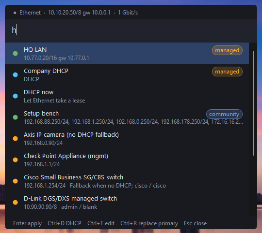

**Contents:** [Features](#-features) · [Install](#-install) · [Quick start](#-quick-start) ·
[Configuration](#-configuration) · [What it runs](#what-it-runs) · [Build](#-build) ·
[Documentation](#-documentation) · [License](#-license)

---

## ✨ Features

| | |
|---|---|
| **Switch networks** | Profiles per adapter (several IPs, gateway, DNS, routes, VLAN) · DHCP in one click · **reach mode**: type an IP and NetPaw gets you onto its subnet · ~60 device presets · hotkeys · auto-switch on known networks · scan for a working profile · verify after every apply |
| **See what is wrong** | Info card (`Ctrl+Alt+I`) with link/gateway/DNS/internet ✓/✗ · plain-language advice · monitor mode · "the browser cannot reach X" watcher · VPN status · incident log |
| **Fix it** | Renew, release, reset adapter, set MTU, delete a stale route — one click each · optional auto-repair |
| **Find things on the wire** | Network map (ARP neighbours, subnet sweep, find routers, Wake-on-LAN) · which switch port am I on (LLDP/CDP) · port check · trace |
| **Scripts and enterprise** | `netpaw-cli` with the same logic · MSI, managed profiles, ADMX policy · signed online profile packs |
| **Updates** | Signed releases · opt-in update check that installs only a verified, signed MSI |

Every feature in detail: **[docs/features.md](docs/features.md)**.

<details>
<summary><b>📸 Screenshots</b></summary>

| the optional main window — Overview · Profiles · Tools · Map · Log |
|---|
| 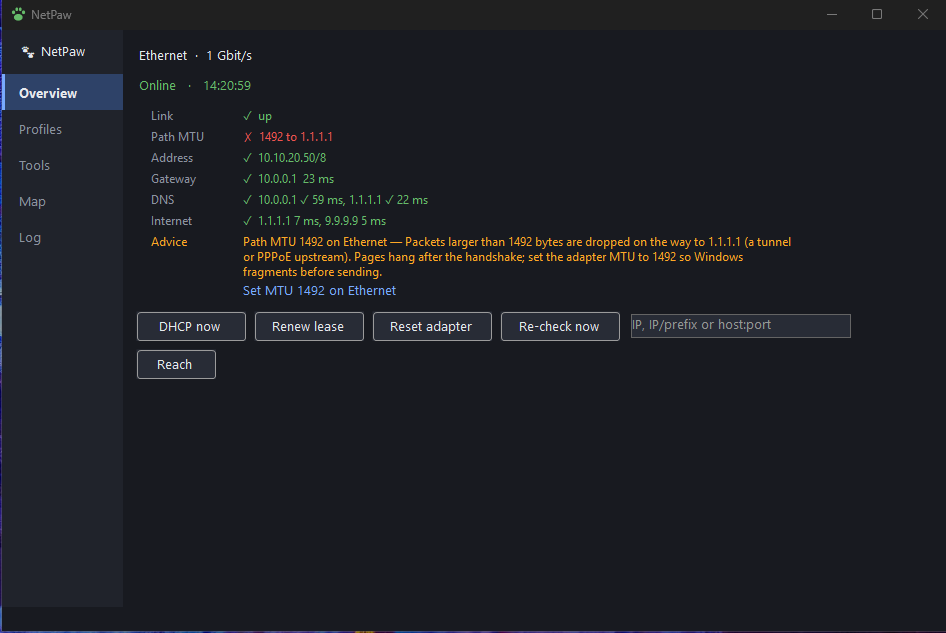 |

| profile editor (managed profile, read-only) | settings with repositories | apply feedback |
|---|---|---|
| 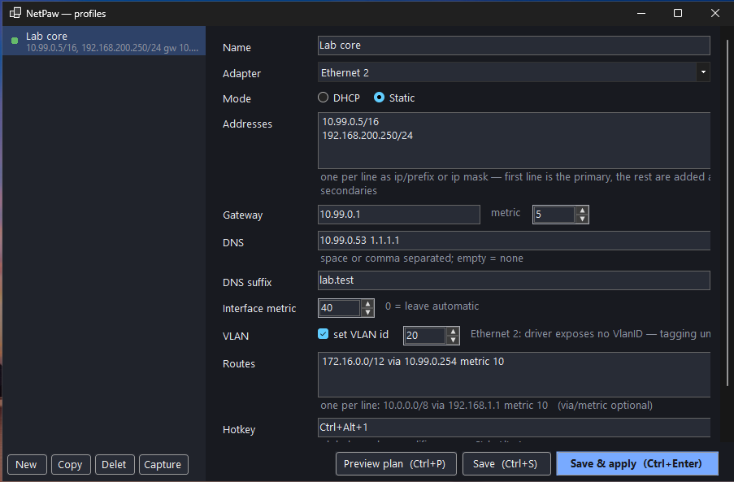 | 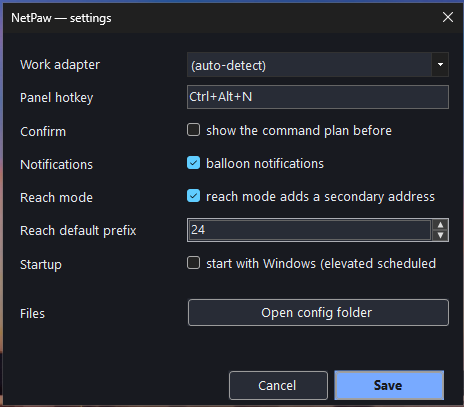 | 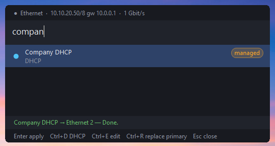 |

| network info card | sticky alert (cable pulled) | advice row | F1 help |
|---|---|---|---|
| 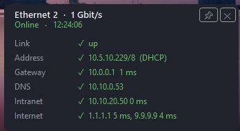 | 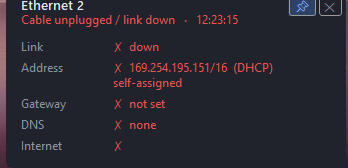 | 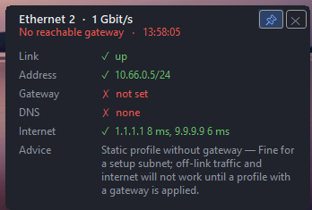 | 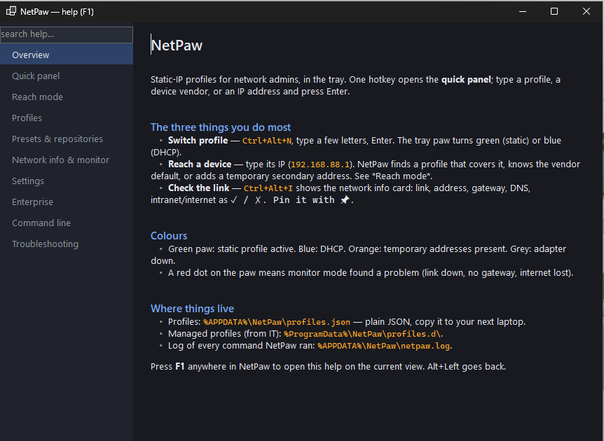 |

| scan for a working profile |
|---|
| 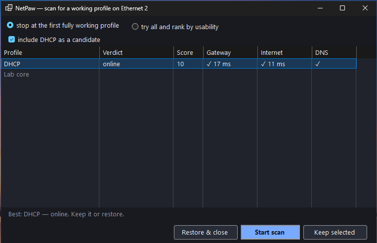 |

| network map — ARP neighbours (right-click → Wake) | which switch port am I on? (LLDP via pktmon) | route table with delete |
|---|---|---|
| 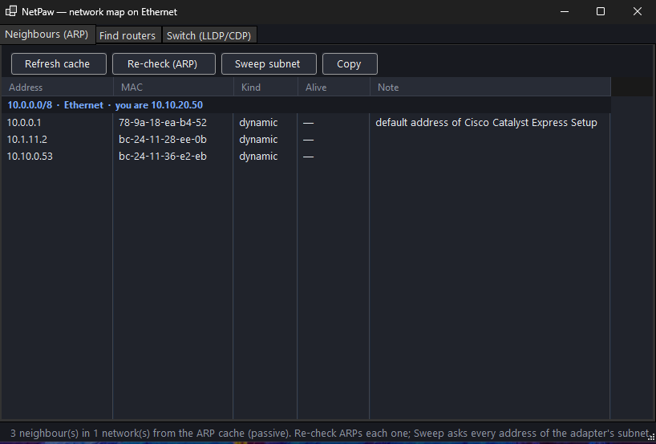 | 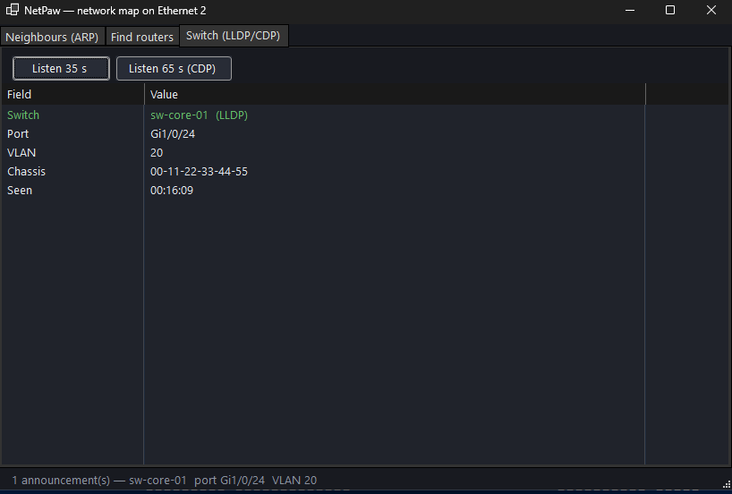 | 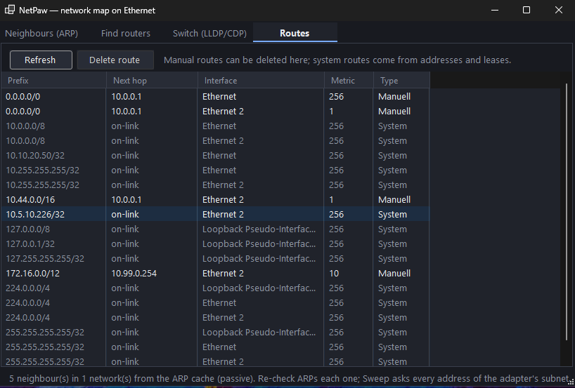 |

| intent watcher — "msedge cannot reach 192.168.88.4 — profile *MikroTik lab* covers it" |
|---|
| 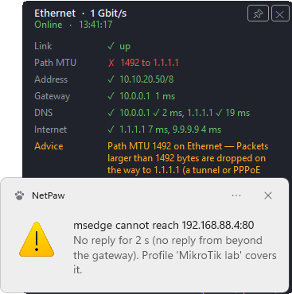 |

*Screenshots from the Windows 11 test VM; every `netsh` path in this README was verified there.*

</details>

---

## 📦 Install

Download from [Releases](../../releases):

| file | for | needs | size |
|---|---|---|---|
| `NetPaw-<version>.msi` | most people; Intune/GPO | [.NET 10 Desktop Runtime](https://dotnet.microsoft.com/download/dotnet/10.0) | ~1 MB, per-machine |
| `netpaw-win-x64.zip` | portable | .NET 10 Desktop Runtime | ~1.5 MB |
| `netpaw-win-x64-standalone.zip` | portable, no .NET installed | nothing | ~85 MB |
| `NetPaw-<version>-telemetry.msi` | opt-in crash reports and usage counts ([TELEMETRY.md](docs/TELEMETRY.md)) | .NET 10 Desktop Runtime | ~1 MB |

Only the `-telemetry` MSI contains telemetry code.

Run `NetPaw.exe`. It asks for elevation once (adapter changes need it) and lives in the tray.
*Settings → start with Windows* adds an elevated scheduled task, so there is no UAC prompt at logon.

> **Signed from v0.13.1.** Each release has `SIGNATURES.md` and `r0.crt`. Windows still shows "unknown
> publisher" because the signing root is a staging root. How to check a download:
> [docs/signed-release.md](docs/signed-release.md).

---

## 🚀 Quick start

| do | how |
|---|---|
| open the panel | `Ctrl+Alt+N`, or left-click the tray paw |
| apply a profile | type a few letters, `Enter` |
| DHCP | `Ctrl+D` in the panel |
| reach a device | type its IP, `Enter` |
| use a device preset | type the vendor: `mikro`, `forti`, `fritz`… |
| save the current config | tray → *Capture current as profile…* |
| what's wrong? | `Ctrl+Alt+I` — the info card |
| help | `F1` anywhere |

The tray paw is **blue** on DHCP, **green** on static, **orange** while temporary addresses are present,
**grey** when the adapter is down.

Everything else — every action, reach mode in detail, monitor mode, VLAN, all CLI commands:
**[docs/usage.md](docs/usage.md)**.

---

## ⚙️ Configuration

Everything is JSON in `%APPDATA%\NetPaw\` (override with `NETPAW_HOME`):

- `profiles.json` — your profiles. Hand-editable, git-able, copy to the next laptop.
- `presets.json` — your own device presets (same schema as the bundled list).
- `settings.json`, `state.json` (temporary addresses), `netpaw.log`, `cache\` (synced packs).
- `%ProgramData%\NetPaw\profiles.d\*.json` — managed profiles from your organisation (read-only).
- `HKLM\SOFTWARE\Policies\NetPaw` — machine policy ([docs/ENTERPRISE.md](docs/ENTERPRISE.md)).

<details>
<summary>Example profile</summary>

```json
{
  "name": "Lab core",
  "adapter": null,
  "dhcp": false,
  "addresses": [ { "address": "10.20.0.5", "prefixLength": 16 }, { "address": "192.168.88.250", "prefixLength": 24 } ],
  "gateway": "10.20.0.1",
  "dns": [ "10.20.0.53" ],
  "routes": [ { "destination": "172.16.0.0", "prefixLength": 12, "gateway": "10.20.0.254", "metric": 10 } ],
  "vlanId": 20,
  "hotkey": "Ctrl+Alt+1"
}
```

`adapter: null` means "the work adapter" (auto-detected: first physical NIC with a gateway; or pick one
in the tray menu).

</details>

### What it runs

No drivers, no service, no hidden WMI writes: a profile becomes plain `netsh` commands, shown in the
preview and in the log.

<details>
<summary>The commands for the example profile</summary>

```
netsh interface ipv4 set address name="Ethernet" source=static address=10.20.0.5 mask=255.255.0.0 gateway=10.20.0.1 gwmetric=1
netsh interface ipv4 add address name="Ethernet" address=192.168.88.250 mask=255.255.255.0
netsh interface ipv4 set dnsservers name="Ethernet" source=static address=10.20.0.53 register=primary validate=no
netsh interface ipv4 add route prefix=172.16.0.0/12 interface="Ethernet" nexthop=10.20.0.254 metric=10 store=persistent
powershell ... Set-NetAdapterAdvancedProperty -Name 'Ethernet' -RegistryKeyword 'VlanID' -RegistryValue 20
```

`set address source=static` replaces every address on the adapter, which is what makes profile
switches deterministic: leftovers from the previous profile or from reach mode are gone in step 1.
The first step is *critical* (a failure aborts the rest); the others are best-effort and reported.

</details>

---

## 🔨 Build

```
dotnet test                                   # core logic, runs on any OS
dotnet publish src/NetPaw.Tray -c Release -r win-x64 --self-contained false -o out
dotnet publish src/NetPaw.Cli  -c Release -r win-x64 --self-contained false -o out
```

<details>
<summary>Repository layout and CI</summary>

- `src/NetPaw.Core` — models, IP math, planner, reach resolver, presets, policy, repos, update check. No
  Windows dependencies, fully unit-tested.
- `src/NetPaw.Tray` — WinForms, dark, no designer files.
- `src/NetPaw.Cli` — the CLI.
- `deploy/` — MSI, ADMX, Intune scripts, public signing certificates.
- `packs/` — online profile packs (not built in).

CI builds, signs and verifies on Linux. The MSI is built and install-tested on a hosted Windows runner.
The release pipeline is described in [docs/signed-release.md](docs/signed-release.md).

</details>

**Not (yet) in scope:** IPv6, Wi-Fi profile switching, multi-VLAN trunk NICs, per-profile firewall
rules. PRs welcome — the planner is pure and tested, so a new step is a small change with a test next to it.

---

## 📚 Documentation

| page | what |
|---|---|
| [features.md](docs/features.md) | every feature in detail |
| [usage.md](docs/usage.md) | every action, reach/monitor mode, VLAN, CLI reference |
| [ENTERPRISE.md](docs/ENTERPRISE.md) | MSI, managed profiles, ADMX policy, Intune |
| [PACK-FORMAT.md](docs/PACK-FORMAT.md) | online profile packs |
| [TELEMETRY.md](docs/TELEMETRY.md) | what the `-telemetry` build sends |
| [signed-release.md](docs/signed-release.md) | signing chain, checking a download, release record |

Plans, research notes and gap analyses: [docs/README.md](docs/README.md).

---

## 📄 License

MIT — see [LICENSE](LICENSE).
